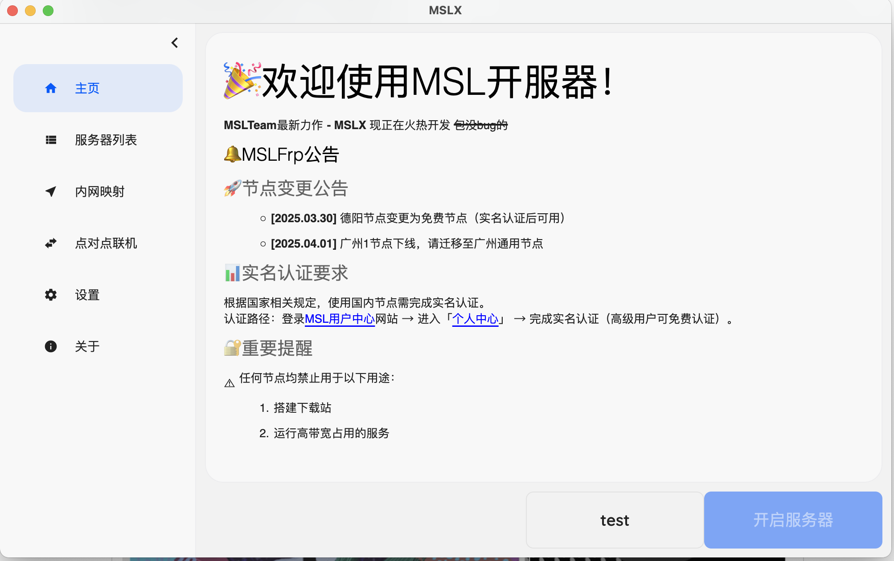
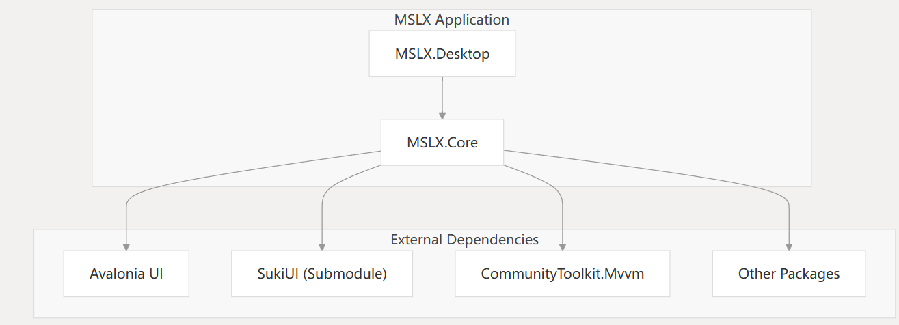
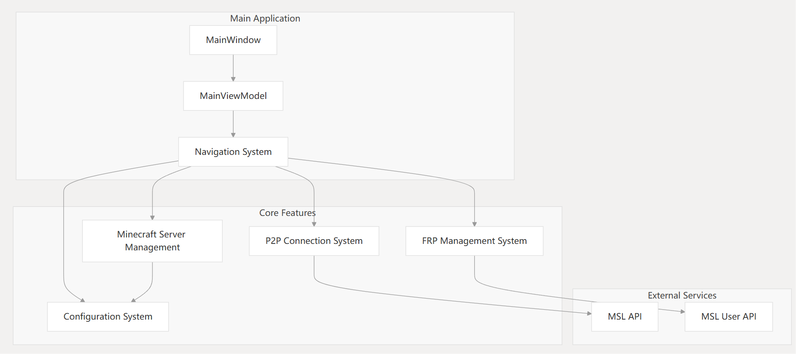
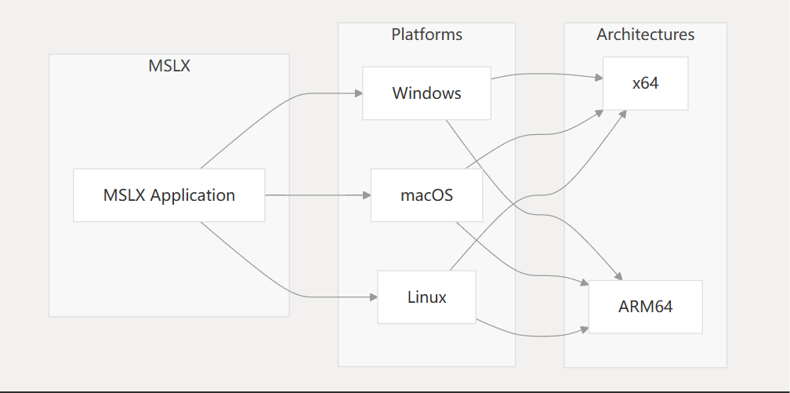

## MSLX

火热开发🔥🔥🔥

MSLX is a cross-platform Minecraft server management application developed by MSLTeam. It provides a modern, user-friendly interface for creating, configuring, and managing Minecraft servers on Windows, macOS, and Linux systems, with support for both x64 and ARM64 architectures.

This page introduces the MSLX repository and its core components. For details about specific subsystems, please refer to their dedicated wiki pages.

Sources: [README.md1-25](https://github.com/MSLTeam/MSLX/blob/aa8b6355/README.md#L1-L25)

## Purpose and Scope

MSLX aims to simplify Minecraft server management through:

- User-friendly interface with modern design
- Cross-platform compatibility (Windows, macOS, Linux)
- Comprehensive server management capabilities
- Advanced networking features (P2P connections, FRP management)
- Multi-architecture support (x64, ARM64)

This application serves as a successor to previous MSLTeam tools, built from the ground up with modern technologies for improved performance and user experience.

Sources: [README.md3-21](https://github.com/MSLTeam/MSLX/blob/aa8b6355/README.md#L3-L21)

## System Architecture

MSLX follows a modular architecture based on the MVVM (Model-View-ViewModel) pattern, with clear separation between the UI and application logic.

### Core Projects Structure

The application consists of two main projects:

1. **MSLX.Desktop**: The executable application project containing platform-specific code and the application entry point.
2. **MSLX.Core**: The main library containing most of the application logic, views, view models, and utilities.

Sources: [MSLX.Desktop/MSLX.Desktop.csproj1-60](https://github.com/MSLTeam/MSLX/blob/aa8b6355/MSLX.Desktop/MSLX.Desktop.csproj#L1-L60) [MSLX.Core/MSLX.Core.csproj1-39](https://github.com/MSLTeam/MSLX/blob/aa8b6355/MSLX.Core/MSLX.Core.csproj#L1-L39)

### Technology Stack

MSLX is built using:

| Component       | Technology                                                   |
| --------------- | ------------------------------------------------------------ |
| Framework       | .NET 9.0                                                     |
| UI Framework    | Avalonia UI                                                  |
| Design Pattern  | MVVM (Model-View-ViewModel)                                  |
| UI Library      | SukiUI (custom submodule)                                    |
| MVVM Framework  | CommunityToolkit.Mvvm                                        |
| Other Libraries | Downloader, Markdown.Avalonia, Material.Icons.Avalonia, Newtonsoft.Json, SharpZipLib, Tommy |

Sources: [MSLX.Core/MSLX.Core.csproj13-34](https://github.com/MSLTeam/MSLX/blob/aa8b6355/MSLX.Core/MSLX.Core.csproj#L13-L34) [Directory.Packages.props1-33](https://github.com/MSLTeam/MSLX/blob/aa8b6355/Directory.Packages.props#L1-L33)

## Core System Components

MSLX is organized around several key functional components that work together to provide the complete server management experience.

The application includes the following core components:

1. **Minecraft Server Management**: Tools for creating, configuring, and running Minecraft servers. For more details, see [Minecraft Server Management](https://deepwiki.com/MSLTeam/MSLX/4-minecraft-server-management).
2. **P2P Connection System**: Facilitates peer-to-peer connections between users for multiplayer games. For more details, see [P2P Connection System](https://deepwiki.com/MSLTeam/MSLX/5-p2p-connection-system).
3. **FRP Management System**: Provides tools for configuring and managing Fast Reverse Proxy, which helps with networking and port forwarding. For more details, see [FRP Management System](https://deepwiki.com/MSLTeam/MSLX/6-frp-management-system).
4. **Configuration Management**: Handles the saving and loading of application settings, server configurations, and FRP configurations. For more details, see [Configuration Management](https://deepwiki.com/MSLTeam/MSLX/3.1-configuration-management).
5. **HTTP and API Services**: Enables communication with external services like the MSL API. For more details, see [HTTP and API Services](https://deepwiki.com/MSLTeam/MSLX/3.2-http-and-api-services).

Sources: [MSLX.Core/MSLX.Core.csproj1-39](https://github.com/MSLTeam/MSLX/blob/aa8b6355/MSLX.Core/MSLX.Core.csproj#L1-L39) [README.md18-21](https://github.com/MSLTeam/MSLX/blob/aa8b6355/README.md#L18-L21)

## Cross-Platform Support

MSLX is designed to run on multiple platforms and architectures:

The application is built and packaged for:

- **Windows** (x64/ARM64)
- **macOS** (x64/ARM64) - both as app bundles and standalone executables
- **Linux** (x64/ARM64)

The CI/CD pipeline automatically creates builds for all supported platforms and architectures when code is pushed to the master branch or a pull request is submitted.

Sources: [README.md8-16](https://github.com/MSLTeam/MSLX/blob/aa8b6355/README.md#L8-L16) [MSLX.Desktop/MSLX.Desktop.csproj3-7](https://github.com/MSLTeam/MSLX/blob/aa8b6355/MSLX.Desktop/MSLX.Desktop.csproj#L3-L7)

## Getting Started

MSLX development builds are available from:

- GitHub Releases: [https](https://github.com/MSLTeam/MSLX/blob/aa8b6355/https#LNaN-LNaN)
- MSL Resource Mirror: https://files.mslmc.cn/MSLX-Dev/Dev

The builds include all necessary runtime components and do not require additional installation.

**Note for macOS users**: There are two versions available for download:

1. App version (with .app extension)
2. Unpacked version

On newer macOS systems, opening the app version may show a "damaged" error. This can be resolved by following the instructions at https://zhuanlan.zhihu.com/p/135948430, or by using the unpacked version.

Sources: [README.md8-16](https://github.com/MSLTeam/MSLX/blob/aa8b6355/README.md#L8-L16)

## Related Wiki Pages

For more detailed information about specific aspects of MSLX, please refer to these wiki pages:

- [Architecture](https://deepwiki.com/MSLTeam/MSLX/2-architecture) - Detailed explanation of MSLX's structure and design patterns
- [Core Services](https://deepwiki.com/MSLTeam/MSLX/3-core-services) - Overview of the main services powering MSLX
- [Minecraft Server Management](https://deepwiki.com/MSLTeam/MSLX/4-minecraft-server-management) - Details on server management functionality
- [P2P Connection System](https://deepwiki.com/MSLTeam/MSLX/5-p2p-connection-system) - Explanation of the peer-to-peer connection features
- [FRP Management System](https://deepwiki.com/MSLTeam/MSLX/6-frp-management-system) - Overview of the Fast Reverse Proxy management capabilities
- [Build and Deployment](https://deepwiki.com/MSLTeam/MSLX/7-build-and-deployment) - Information about the CI/CD pipeline and build process

Sources: [README.md18-21](https://github.com/MSLTeam/MSLX/blob/aa8b6355/README.md#L18-L21)